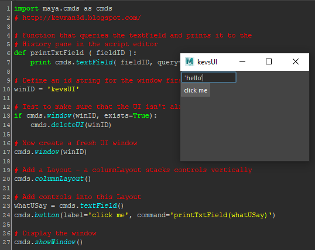
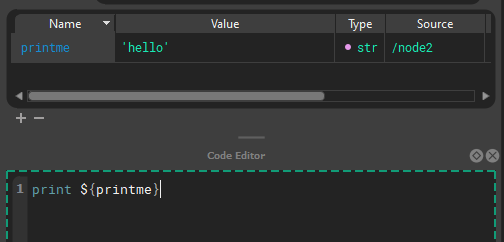

# Concept quick start

## Nodes

Graphs are made of node hierarchies. Node hierarchies can be collapsed by double clicking. During execution, a root node is executed, then it's descendants are executed depth first, then the next root node is begun. Execution sequencing between nodes is done via a special attribute: "Exec Input" where a node specifies the root node that is _before_ it in execution.

In the above example, the execution order would be: `/parent`, `/parent/child1`, `/parent/child1/child2`, `/parent/sibling`, `/parent/sibling2`, `/node`, `/node/node`

## Attributes

Rather than building a custom UI to interact with code, you edit attributes on [nodes ](reference.md#node)in a familiar property editor. Nxt [substitutes ](reference.md#stagecomposition) [attributes ](reference.md#attributes)into the body of the  [code ](reference.md#compute)on the fly and generates linearly executed bespoke programs. It lets you interact via properties without writing, managing, and extracting data from a UI. 

| All of this to print a value   | Less                               |
| ------------------------------ | ---------------------------------- |
|  |  |

Attributes can refer to other attributes and are [composited ](reference.md#stagecomposition)on the fly, or attributes can be used directly in code. These are called [tokens](reference.md#tokens).

## Inheritance

Each tree [inherits ](reference.md#stagecomposition)all the attributes of their parent nodes. (All of this can be easily hidden via `1,2,3` hotkeys) Those attributes are available to child nodes. Each child node can overwrite the value, or use the inherited value.

## Layers

Nxt also incorporates a [layering ](reference.md#layers)model where attributes and code can be overridden by nodes on higher layers and leave the underlying structure intact.

## Instances

Finally, any node can be instanced and overridden by layers or nodes.

[Instancing ](reference.md#instancing)allows you to reuse node trees from other parts of the graph with specific overrides.

