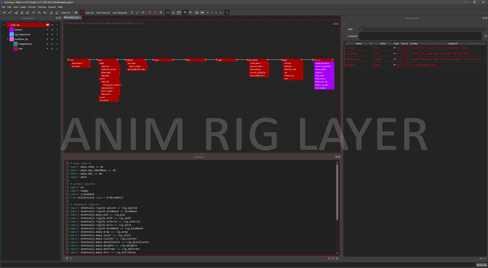

# NXT - Node eXecution Tree

nxt (/ɛn·ɛks·ti/) is a general purpose code compositor designed for rigging, 
scene assembly, and automation.

*It’s code with layers with a nice way to see and change data.*

## Introduction

The primary function of nxt is to visualize and automate programming tasks 
related to computer graphics and linear processing. The intent is to bridge 
the gap between one-off scripting and general purpose tools through the use of 
inheritance, layering, and string tokens.
## Why use nxt?
The core functionality of nxt was built with insights from industry veterans 
of various technical and artistic backgrounds. We set out to bring to the
 table a simple set of principles:

- Visualize a map of what a complex script is actually doing. 
[Nodes](reference.md#node), [inheritance](concepts.md#inheritance), and
connection lines are easy to understand. However, we've gone a step further 
and added string [tokens](reference.md#tokens). An instant visualization 
of what an attribute value _actually_ is. Our tokens can be used _almost_
anywhere inside nxt and are dynamically "resolved" during execution. Allowing the
user to see exactly what data is flowing around without the use of an
external debugger.
- Encourage collaboration though [layering](reference.md#layers) and multi context graphs. 
With our layering system it is easy for departments to share base workflows and
utility nodes. Since layering is non-destructive graphs can referenced built on 
without worrying about breaking someone else's graph. With [multi context](extensions.md#creating-custom-contexts) 
graphs a Maya user, for example, can directly call a Houdini graph from inside Maya. 
Alternatively, graphs can call other graphs in the same context, allowing 
interdependent graphs to be developed simultaneously.
- Make code accessible to everyone. Artists can modify attributes like their
used to and learn to make simple code changes that normally would require a 
TD to intervene. We're not visual programming, but rather a friendly visual
portal into code.

## What does nxt do?
In the simplest of terms nxt combines multiple layers of nodes into a single 
composite layer that is then executable. Something like Photoshop layers for
your code, you're able to mute, solo, override, and extend layers of code. 
The resulting composite of the code clearly visualizes where attributes and
their values came from. Colors, node paths, and conveniently placed buttons/links 
allow users to quickly jump to and correct erroneous values.

*Example character rig with a general to specific layer structure*

## Limitations
- We currently do not support asynchronous execution in a single graph. Our 
current focus is on lineal scripts.
- We are [not visual programming](reference.md#design-philosophy), no for loop nodes sorry.
- We currently do not support Python 3, however it is on the top of our
priority list.

|  |  |
| :---: | :---: |
| Concepts | Tutorials |
| See [concepts](concepts.md) for a quick overview of nxt's core concepts. | See the [tutorials](tutorials.md) for a step by step walkthroughs |
