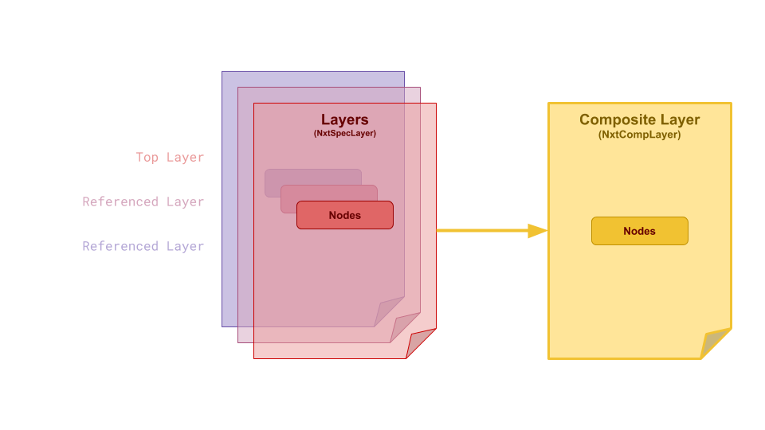
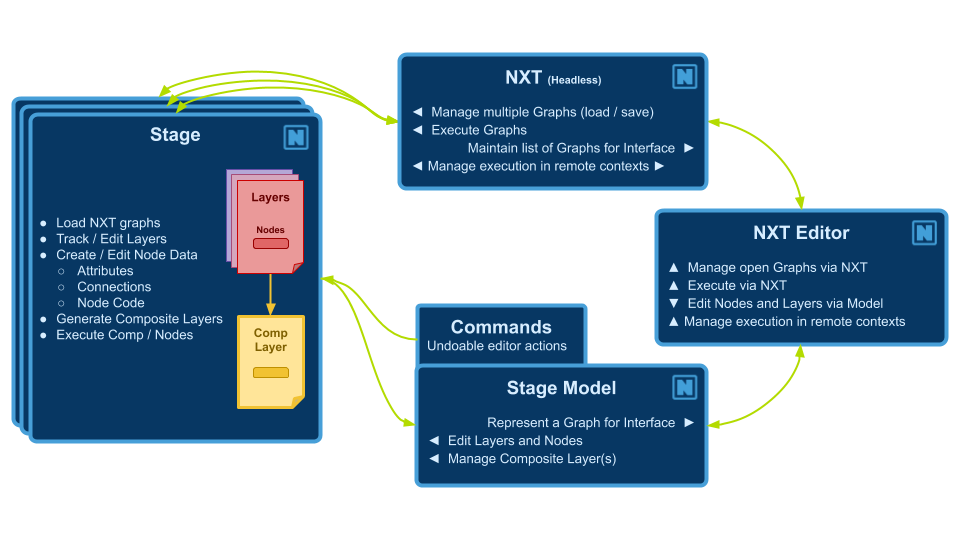

# Example Graphs
Checkout our example graphs [here](https://github.com/nxt-dev/nxt_editor/tree/release/examples).

*If you're looking for workflow checkout our workflow and transition map [here](workflows.md).*

# Editors

Stage

Node Properties

Code Editor

Layer manager

Tool Bar

Output Log

Build View

History View

[Hotkey Editor](hotkeys.md)

# Terms and Definitions

## Stage

The stage is a collection of graphs, trees, and layers of nxt [nodes ](#node)that set the [composition structure](#stagecomposition) and [execution order](#executionorder) for an nxt file.

!!! note "Stage attributes and composition"
    Note that each layer is also a node, and those nodes get composited to the master STAGE. Each node that is parented to a layer inherits the attributes of the layer/stage. This can be useful for defining global variables, or a state that needs to propogate into the entire graph.

## Node

A node is a container for code (or compute) and a collection of attributes. Every node contains a single [code block](#compute) that is executed when a node is run. [Execution order](#executionorder) is defined both by hierarchy and connections to execution plugs on the nodes.

## Attributes

[Nodes](#node) contain [attributes ](#attributes)that are read from and written to from inside a node’s [code block](#compute). Attributes can also be connected to inputs and outputs of other nodes via [tokens ](#tokens)in  attributes, token paths within the code block, or dragging and dropping attribute connections between nodes.

At editor time (before the graph has begun [executing](#executionorder)) attribute values can be composited into other attribute’s values or into the text of a code block via `${path/to/node.otherattr}_rest_of_attr_value`. 

A node’s local attributes can be resolved by name alone via `${attrname}`

!!! note "Hotkeys"
    The raw/composited state can be visualized by toggling editor resolution on and off using `Q`, `W`, `E`.
    NXT includes a full hot key editor. (Window > [Hotkey ](hotkeys.md)Editor)

!!! example
    The node at `/path/to/node` has the attribute `otherattr` with the value `simple_stupid`, and our local node has an attribute named `myattr` with the value `never_eat`

    | Unresolved                       | Resolved                 |
    | -------------------------------- | ------------------------ |
    | keep_it_${path/to/node.attrname} | keep_it_simple_stupid    |
    | ${myattr}_shredded_wheat         | never_eat_shredded_wheat |

!!! warning "Cached view"
    Cached view should only be used to inspect and debug your data. It should not be considered accurate, _especially_ if you are changing the data via the `self.attribute` paridigm. Any data that NXT is not confident in will be drawn with red hashes.


A node’s local attributes can be changed inside a node’s code block following python convention as seen below.

    self.attr_name = 'example code'
    print(self.attr_name + ' is always boring.')

While executing, the [Stage](#stage) can have arbitrary attributes add/set/retrieved on it, that will be available to all nodes, as seen below. Note: Inside a node’s codeblock the stage is accessed via all caps STAGE

    STAGE.anyattr = 'anything you want'
    print(Stage.anyattr)

!!! note "Attribute connections"
    It is best practice to display inter-node dependencies via hierarchy or connections of attributes, rather than hide that dependency in the code. This will make your layers more portable and friendly to other users. Despite this best practice, other nodes and their attributes can be accessed inside a code `block using STAGE.lookup('path/to/node')` and `STAGE.lookup('path/to/node.otherattr')`.

## Tokens

A token is like a [reference or pointer](workflows.md#transitionguide) to another token or value. [OS ](workflows.md#transitionmap)style pathing is used to resolve attribute and file tokens.

Attribute token syntax is `${}`: if it can resolve, it substitutes the attribute, if not it will be empty

```
        ${attribute}
        ${/absolute_node_path.attribute}
        ${../relative_nodepath.attribute}
```

File validation syntax `${file::}`: this will always resolve to a real file, and will return an empty string if the file doesn't exist. Used to validate files for reading.

```
        ${file::file.nxt}
        ${file::C:/absolute_path/file.nxt}
        ${file::../relative_path/file.nxt}
```

File path token syntax `${path::}`this will  attempt to resolve to a valid path. If not, it will be empty. Used to expand paths for writing.

File path token syntax `${contents::}` will include the contents of an external file. For example, `${contents::${file::external.py}}` will include the contents of `external.py` in the attribute, compute, _and_ it will resolve tokens written within this file.

!!! note "Relative file resolution"
    The `${file::}` and `${path::}` tokens will resolve relative paths based on the parent folder of the current display layer.

!!! note "Using an external IDE"
    The `${contents::}` token allows the use of an external IDE for authoring your compute blocks.

Tokens are _not_ python template strings, even though they share the syntax.

!!! note "Quote behavior in tokens"
    Since all attribute values are stored and processed as strings in NXT before they are composed as python objects, you have do manually manage string attributes. The value will _substitute as written_. In some cases, it makes sense to have string attributes in quotes, in other cases, it makes sense to add quotes in the code block. 
    For example if you had an attribute `side` set to a value of `L`

    `foot_${side}` and `'foot_' + '${side}'` are equally valid. This really comes down to convention.
    
    There is a simple `w()` convivence function to assist with adding quotes when using a python string object as a string.
    
    ```
    my_attr = 'quotes go away when it becomes a string object'
    self.attribute = w(my_attr)
    ```
    
    `my_attr` can now be used by downstream nodes as a string

## Compute

The compute block/code block  is standard python code, with the exception that it will deep-resolve tokens over 1000 levels deep. (should this be a preference?)


!!! note "Hotkeys"
    The raw/composited state can be visualized by toggling editor resolution on and off using `Q`, `W`, `E`.

    `numreturn` or `ctrl+enter` or clicking off the code will accept your edit
    
    `tab` and `shift+tab` handle multi-line indents
    
    NXT includes a full hot key editor.(Window > [Hotkey ](hotkeys.md)Editor)

## Execution Order

### Stage/Layer Node
_Stub for this feature once new layer editor arrives_

### Execution Root

A stage can have root nodes with no parent node and no node connected to it’s input execution plug. Use execute tags to define the order


### Execution Plugs

Nodes have execution plugs on their left and right to determine execution order. Nodes are executed from left to right along the execution chain specified by these connections.


!!! danger
    We don't have checks for circular dependencies yet. So don't setup loops.

### Hierarchies/Stacks

Nodes have relationships we refer to as “parent”, “child”, and “sibling” to describe their relationship to one another inside the stage to influence composition and execution order. 


To begin execution from a given node, the first node is run, followed by a depth first execution of each of it’s descendants. Following the execution of the descendants, the root node whose input [execution plug](#executionplugs) is connected to the current node’s output execution plug will be run following the same logic.

## Stage Composition

### Layers

[Stages ](#stage)are designed to be combined together to create a hierarchy of instructions that can be reused and repurposed by several NXT users for use on several assets or workflows. When a stage is referenced into another stage, it is a “layer” within that stage.



All of the layers in your file are composited together to produce final code to execute. Each layer has the power to change as much or as little as is needed to customize the composited node’s attributes and code block. These changes are stored in the file they are made on, keeping referenced files safe to use for many purposes.

Layer color propagates into nodes an also attributes.


### Composition Inside Node Hierarchies

When a [node ](#node)is a child of another node, it [inherits ](concepts.md#Inheritance)its [attributes ](#attributes)from that node which can be overwritten locally on the node.

## Instancing

Instancing allows you to reuse nodes from other parts of the graph with specific overrides. 

Instances in NXT can be simple and powerful. But they can also be extremely complicated with mind-bending edge cases. In simple terms, you can think about an  instance as a clone of another node. It's like a live copy. But it's a bit more nuanced to think about an instance like an additional parent that's outside the hierarchy.

!!! example

    - If you create a node, don't add any attributes or code, it will just look like a clone of the instance source.
    
    
    
    - If you create a node with unique attributes it will look like the instance source is another parent. All the attributes will composite from the instance source, and the local attributes will be visible as well.
    
    
    - If you create a node with attributes named the same as the instance source, the local attributes will have a stronger opinion and overwrite the instance values. In this case, `cat` exists on `custom_node` so it's value wins.
    

The children of the instance node get inserted into the hierarchy as proxy children. This data exists only as a result of the composite. The are not local saved data. Proxy children are drawn in a hashed style to make it clear you haven't touched the data.


As soon as you begin to edit proxy children, the are converted into real editable nodes and exist in the hierarchy

!!! note
    The hierarchy has the final opinion in the composite. _UNLESS_ the node has an local opinion on the data.

    - Layer stage
    - Node parent
    - Node
    - Instance parent
    - Instance

!!! example
    Build a base arm. Instance it twice. Change L to R, done.
    

An instance of a node inherits data like a child. It creates proxy children of the instance source’s children, and can be arranged into a separate parent-child relationship as it’s instance source. 

Most instance attributes are carried over. Execution input is never inherited. Child order is inherited by instances but not by children.

Data comes from the hierarchical parent as well as the instance source, with hierarchical parent  having final word. Instance execution order is defined by the hierarchical parent.

!!! danger
    If a node instances itself, or any ancestor or descendants, it will crash. It's best (because that's all thats possible) to only instance from other hierarchies or sibling nodes

# NXT file spec

NXT files follow standard `.json` file specifications with a few specific keys in the root dictionary. 

---TODO: Figure out what these keys are.

# Design Philosophy

Nobody will ever read this pretentious wall of text, but it was an important part of the development process. We hope you find it interesting, and you may find your way here if your start to dig deeper and wonder why things are the way they are.

### Discovery

Nxt provides a visual map/model of user facing attributes that can be understood at a glance, and presents the code in context. This invites the user to extend and modify the functionality. 

Nxt is designed around making processes and code as accessible as possible with low overhead. 

- Artists can modify attributes on code templates and learn to make code changes that would normally require a TD.

- TD’s can establish layered templates for processes and write nodes and graphs.

- Developers can provide Nxt ‘factory nodes’ for using their tools without writing a custom UI.

### Functional/Procedural

Nxt follows a functional model. It eschews object oriented inheritance with a layer model. This allows data to be inspected on the fly and easily read.

##### Why not visual programming?

Nxt differs from a visual programming environment where every function (math, concatenation, data, flow control) is wrapped up in a node. Fully visual programming environments result in sprawling graphs. While the functions are readable, they are not dense. Nxt displays code standard text notation but creates a visualization for the data.

- VP graphs can be tedious to construct. A simple operation can often require a dozen nodes but could be represented in 3 lines of code.

- VP graphs are code under the surface anyway, so to extend the functionality, you need to write code, or construct graphs of graphs.

- VP is a great tool for visualization of your data and flow, readability, experimentation, and discovery.

- NXT is half visual. Half code. Seeks to keep the best parts and remove the friction for more seasoned developers.

##### Why not Houdini?

Houdini is a tool for building tools. It’s a visual processing engine. Can’t it do all of this already?

- Houdini doesn’t do layering

- Houdini is great, but maybe not the best at everything

- Artists have decades of experience in other tools

- Large segments of production already built around need to be built around Maya, Nuke, Unreal

- HDA’s are black boxes and can be slow in host applications

- PDG is great, and expensive.
  
# Application structure


