# Example Graphs
Checkout our example graphs [here](https://github.com/nxt-dev/nxt_editor/tree/release/examples).

*If you're looking for workflow checkout our workflow and transition map [here](workflows.md).*

# Editors

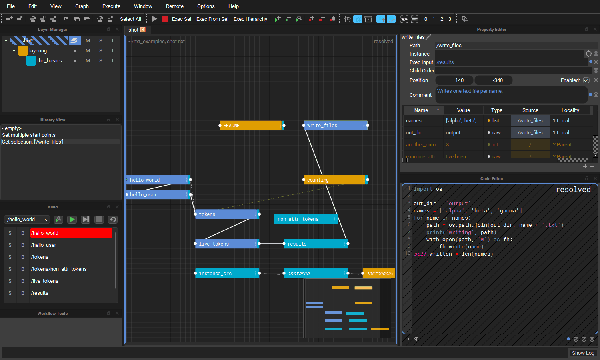

The editor is made of a graph (the stage view) in the middle, surrounded by
dock widgets that can be moved, tabbed and closed: the Layer Manager,
Property Editor, Code Editor, History View, Build View, Workflow Tools,
Output Log and [Hotkey Editor](hotkeys.md). Closed docks come back from the
**Window** menu.

## Stage View

The stage view draws the composited graph for the open tab. Each tab is
composited and drawn the first time it is selected, and kept from then on,
so switching back to a tab is instant.

### Mini map

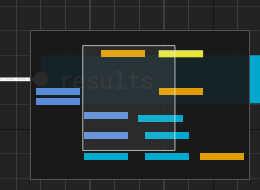

The mini map in the bottom right corner shows the whole graph, the selected
nodes, and a rectangle for the part of the graph the view is showing.

- Click anywhere in the mini map to centre the view there, or drag in it to
  pan.
- Toggle it with **View > Toggle Mini Map** or `Ctrl+M`. The choice is
  remembered between sessions.

### Animate Nodes

Nodes no longer slide open when a parent is expanded. Every child is
animated separately, so a node with hundreds of children opens noticeably
slower that way. The **Animate Nodes** action turns the animation back on.
It is listed under **Graph** in the [Hotkey Editor](hotkeys.md#graph),
where you can give it a shortcut, and the choice is remembered between
sessions.

### Deleting and pasting nodes

`Del` removes the selected node from the target layer. If no other layer has
an opinion on the deleted node's path, its descendants are removed with it,
so nothing is left behind as an implied "ghost" node. If another layer does
provide the node, the node from that layer shows through, as you would
expect from [layering](#layers). `Shift+Del` deletes the node and all of its
descendants.

Pasting nodes (`Ctrl+V`) is a single step on the undo stack however many
nodes are pasted.

## Code Editor

The code editor shows the compute of the selected node. It is read only
until you **double click** into it. Accept your edit with `Ctrl+Enter`, the
numpad `Enter`, or by clicking off the code, and cancel it with `Esc`.

The shortcuts below only apply while the code editor has focus, so for
example `Ctrl+D` expands the selection in the code editor but duplicates the
selected node in the graph. While the code editor, or one of its find
fields, has focus the main window's shortcuts are suspended so typing cannot
trigger them. All of these can be rebound in the
[Hotkey Editor](hotkeys.md#code-editor), and most are also on the code
editor's right click menu, with the line commands under **Line**.

| Action | Shortcut | Notes |
| :----- | :------: | :---- |
| Find In Code | `Ctrl+F` | Opens the find panel, filled in with the selected text |
| Replace In Code | `Ctrl+H` | Opens the find panel with the replace row showing |
| Find Next / Find Previous | `F3` / `Shift+F3` | Wraps around at either end |
| Go To Line | `Ctrl+G` | |
| Duplicate Line | `Ctrl+Shift+D` | Copies the selected line(s) below |
| Move Line Up / Down | `Alt+Up` / `Alt+Down` | |
| Delete Line | `Ctrl+Shift+K` | |
| Expand Selection | `Ctrl+D` | The word under the cursor, then the line, then everything |
| Complete Word | `Ctrl+Space` | See [Completion](#completion) |
| Indent / Un-Indent Line | `Tab` / `Shift+Tab` | Works on several lines at once |
| Comment Line | `Ctrl+/` | |
| Execute Selection Locally | `Shift+Return` | |
| Execute Selection Globally | `Ctrl+Shift+Return` | |
| Copy Resolved Code | `Ctrl+Shift+C` | |

!!! note "Two kinds of find"
    `Ctrl+F` in the code editor searches the compute you are looking at.
    `Ctrl+F` anywhere else opens the graph wide **Find and Replace**, which
    searches node attributes across the whole stage.

### Find and replace

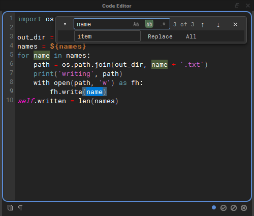

The find panel floats over the top right corner of the code, so the code
never moves when it opens.

- Type in the **Find** field and every match is highlighted, with the
  current match in a stronger colour. The counter shows which match you are
  on (`3 of 3`), or `bad pattern` when a regular expression is not valid.
- `Enter` and `Shift+Enter` in the field, `F3` and `Shift+F3`, or the arrow
  buttons step through the matches.
- The three toggles inside the field are **regular expression** (`.*`),
  **whole word** (`ab`) and **match case** (`Aa`).
- The chevron on the left shows the replace row. **Replace** replaces the
  current match and moves on to the next one; **All** replaces every match
  in one undoable step. Replacing needs the editor to be in editing mode;
  while it is read only the panel says *double click to edit*.
- `Esc` closes the panel.

### Go to line

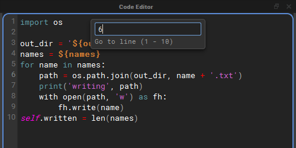

`Ctrl+G` drops a small field from the top of the editor. The view scrolls to
the line as you type, `Enter` goes there, and `Esc` puts the cursor back
where it was before you started.

### Highlighting

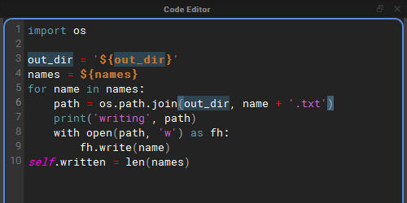

Every use of the word under the cursor is highlighted, and so is the bracket
next to the cursor together with its partner. A bracket without a partner is
drawn in a warning colour.

### Completion

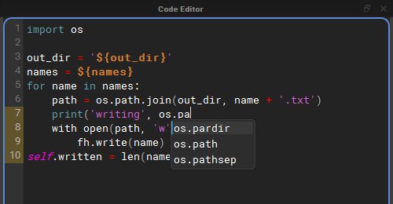

`Ctrl+Space` offers completions for the word in front of the cursor. Use the
arrow keys to choose one and `Enter` or `Tab` to insert it; `Esc` closes the
list. With **Code Editor Autocomplete** on, the list also appears by itself
once you have typed two characters of a word.

Completions come from four sources:

| Source | What it offers |
| :----- | :------------- |
| Python Builtins | Python's keywords and builtins, such as `return` and `enumerate`. |
| Imported Modules | Names inside the modules this compute imports: `os.pa` offers `os.path`, and `os.path.jo` offers `os.path.join`. Aliases such as `import numpy as np` are understood. Only modules named on the compute's own import lines are looked at, and a module that fails to import is skipped. |
| Node Attributes And Tokens | The node's attributes written as `name`, `self.name` and `${name}`, plus `self`, `STAGE`, and the token prefixes nxt knows about, including any added by plugins: `${file::`, `${filelist::`, `${path::` and so on. |
| Words In This Compute | Words already written in the compute, which catches your own variable names. |

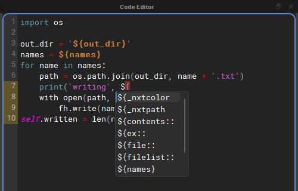

#### Autocomplete options

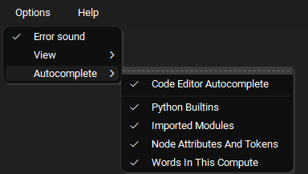

**Options > Autocomplete** holds the completion switches. They are all on by
default and remembered between sessions, and a change applies straight away,
even to a list that is already open.

- **Code Editor Autocomplete**: offer completions while you type. When it is
  off, completions only appear when you press `Ctrl+Space`.
- **Python Builtins**, **Imported Modules**, **Node Attributes And Tokens**
  and **Words In This Compute**: the sources described above.

## Layer Manager

The Layer Manager lists the layers of the open graph: the top layer and,
nested under it, the layers it references. Right click a layer for its
menu.

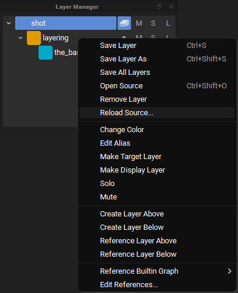

Two items on this menu change what a layer pulls in from disk:
**Edit References...** and **Reload Source...**.

### Reference Editor

**Edit References...** opens the Reference Editor on that layer.


- **Layer** picks which layer's references you are editing. Only layers that
  are open in this graph and not locked can be edited.
- **The list** holds that layer's references in stack order: a reference
  higher in the list is stronger than the ones below it. Drag a row, or use
  the up and down arrow buttons, to change the order.
- **The field under the list** edits the selected reference. What you type
  is stored exactly as written, so a path with an environment variable in
  it, a path relative to the layer, or a path under one of your
  [file roots](#how-references-are-found) keeps working on other machines.
  The folder button next to the field picks a file with a file browser
  instead. A picked file that sits next to the layer, or in a folder below
  it, is stored relative to the layer; anything else is stored as a full
  path.
- **+** adds an empty row and puts the cursor in the field, ready to type.
  An empty row that is never filled in is dropped. **-** removes the
  selected reference.
- **The resolved toggle** next to the layer picker switches every row
  between the path as stored and where it resolves to on this machine.
  Resolved paths are only for looking: they cannot be edited, so this
  machine's answer is never written into the layer.
- **Missing references** are drawn in red and counted
  (`1 could not be found`). They are kept exactly as written, in case they
  resolve on another machine. Hover over a row to see where nxt looked.

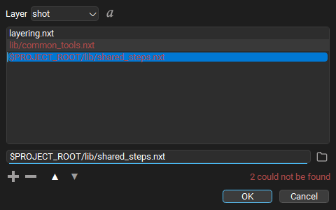

Pressing `Enter` in the field does not close the dialog. **OK** applies the
change to the open graph: the referenced layers are reloaded, the graph is
composited again, and the layer is marked unsaved. Nothing is written to
disk until you save the layer. Applying is one step on the undo stack, and
pressing **OK** with nothing changed does nothing at all.

### Reload Source

**Reload Source...** reads a layer from disk again, for example when
somebody else has saved a file your graph is built on. It is on every
layer's right click menu, and in the **File** menu next to **Save Layer**,
where it acts on the target layer.


A layer is rarely just one file, so the dialog lists the layer and every
layer it references, as deep as they go, indented to show which layer
references which. Every row starts checked; uncheck the files you do not
want read again, or use the **Uncheck All** / **Check All** toggle. A file
referenced from several places is listed once. Rows with unsaved changes say
so, because reloading them throws those changes away.

**Reload Checked** reads the checked files again and composites the graph.
If a file now references something different, the layer stack follows it:
layers can appear, disappear or change order. Reloading is one step on the
undo stack, and undoing it puts back exactly what each layer held before,
without reading the files again.

## Build View

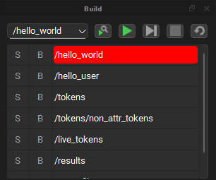

The Build View lists the nodes that will run, in execution order, from the
start point chosen in the drop down. Next to the drop down are buttons to
find the selected node, run the build, step through it, stop it and
restart it.

- **Find the selected node** (the magnifier) scrolls the build so the node
  selected in the graph is at the top of the list, and marks its row. A
  selected node is not always part of the build: it may be disabled,
  outside the start point's branch, or not executable at all. In that case
  the Output Log says the node is not in the build, and the editor dings.
- The build stays current as you edit. Enabling or disabling a node,
  changing a start point, exec input, child order, instance path or parent,
  and renaming or deleting a node all update the list straight away.
- If the graph has changed since the last run in a way the cached runtime
  does not know about (a node was moved, renamed or deleted), the cache is
  cleared and rebuilt when the build is set up, before anything runs, and
  the Output Log says so.

## Property Editor, History View, Output Log and Workflow Tools

See the [tutorial videos](tutorials.md) for a tour of these. The History
View lists every step on the undo stack, including reference edits and
reloads.

# Terms and Definitions

## Stage

The stage is a collection of graphs, trees, and layers of nxt [nodes ](#node)that set the [composition structure](#stage-composition) and [execution order](#execution-order) for an nxt file.

!!! note "Stage attributes and composition"
    Note that each layer is also a node, and those nodes get composited to the master STAGE. Each node that is parented to a layer inherits the attributes of the layer/stage. This can be useful for defining global variables, or a state that needs to propogate into the entire graph.

## Node

A node is a container for code (or compute) and a collection of attributes. Every node contains a single [code block](#compute) that is executed when a node is run. [Execution order](#execution-order) is defined both by hierarchy and connections to execution plugs on the nodes.

## Attributes

[Nodes](#node) contain [attributes ](#attributes)that are read from and written to from inside a node’s [code block](#compute). Attributes can also be connected to inputs and outputs of other nodes via [tokens ](#tokens)in  attributes, token paths within the code block, or dragging and dropping attribute connections between nodes.

At editor time (before the graph has begun [executing](#execution-order)) attribute values can be composited into other attribute’s values or into the text of a code block via `${path/to/node.otherattr}_rest_of_attr_value`. 

A node’s local attributes can be resolved by name alone via `${attrname}`

!!! note "Hotkeys"
    The raw/composited state can be visualized by toggling editor resolution on and off using `Q`, `W`, `E`.
    NXT includes a full hot key editor. (Window > [Hotkey ](hotkeys.md)Editor)

!!! example
    The node at `/path/to/node` has the attribute `otherattr` with the value `simple_stupid`, and our local node has an attribute named `myattr` with the value `never_eat`

    | Unresolved                       | Resolved                 |
    | -------------------------------- | ------------------------ |
    | keep_it_${path/to/node.attrname} | keep_it_simple_stupid    |
    | ${myattr}_shredded_wheat         | never_eat_shredded_wheat |

!!! warning "Cached view"
    Cached view should only be used to inspect and debug your data. It should not be considered accurate, _especially_ if you are changing the data via the `self.attribute` paridigm. Any data that NXT is not confident in will be drawn with red hashes.


A node’s local attributes can be changed inside a node’s code block following python convention as seen below.

    self.attr_name = 'example code'
    print(self.attr_name + ' is always boring.')

While executing, the [Stage](#stage) can have arbitrary attributes add/set/retrieved on it, that will be available to all nodes, as seen below. Note: Inside a node’s codeblock the stage is accessed via all caps STAGE

    STAGE.anyattr = 'anything you want'
    print(Stage.anyattr)

!!! note "Attribute connections"
    It is best practice to display inter-node dependencies via hierarchy or connections of attributes, rather than hide that dependency in the code. This will make your layers more portable and friendly to other users. Despite this best practice, other nodes and their attributes can be accessed inside a code `block using STAGE.lookup('path/to/node')` and `STAGE.lookup('path/to/node.otherattr')`.

## Tokens

A token is like a [reference or pointer](workflows.md#transition-map) to another token or value. [OS ](workflows.md#transition-map)style pathing is used to resolve attribute and file tokens.

Attribute token syntax is `${}`: if it can resolve, it substitutes the attribute, if not it will be empty

```
        ${attribute}
        ${/absolute_node_path.attribute}
        ${../relative_nodepath.attribute}
```

File validation syntax `${file::}`: this will always resolve to a real file, and will return an empty string if the file doesn't exist. Used to validate files for reading.

```
        ${file::file.nxt}
        ${file::C:/absolute_path/file.nxt}
        ${file::../relative_path/file.nxt}
```

File path token syntax `${path::}`this will  attempt to resolve to a valid path. If not, it will be empty. Used to expand paths for writing.

File path token syntax `${contents::}` will include the contents of an external file. For example, `${contents::${file::external.py}}` will include the contents of `external.py` in the attribute, compute, _and_ it will resolve tokens written within this file.

!!! note "Relative file resolution"
    The `${file::}` and `${path::}` tokens will resolve relative paths based on the parent folder of the current display layer.

!!! note "Using an external IDE"
    The `${contents::}` token allows the use of an external IDE for authoring your compute blocks.

Tokens are _not_ python template strings, even though they share the syntax.

!!! note "Quote behavior in tokens"
    Since all attribute values are stored and processed as strings in NXT before they are composed as python objects, you have do manually manage string attributes. The value will _substitute as written_. In some cases, it makes sense to have string attributes in quotes, in other cases, it makes sense to add quotes in the code block. 
    For example if you had an attribute `side` set to a value of `L`

    `foot_${side}` and `'foot_' + '${side}'` are equally valid. This really comes down to convention.
    
    There is a simple `w()` convivence function to assist with adding quotes when using a python string object as a string.
    
    ```
    my_attr = 'quotes go away when it becomes a string object'
    self.attribute = w(my_attr)
    ```
    
    `my_attr` can now be used by downstream nodes as a string

## Compute

The compute block/code block  is standard python code, with the exception that it will deep-resolve tokens over 1000 levels deep. (should this be a preference?)

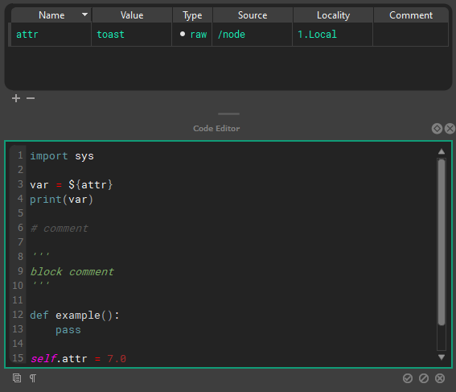

!!! note "Hotkeys"
    The raw/composited state can be visualized by toggling editor resolution on and off using `Q`, `W`, `E`.

    `numreturn` or `ctrl+enter` or clicking off the code will accept your edit
    
    `tab` and `shift+tab` handle multi-line indents
    
    NXT includes a full hot key editor.(Window > [Hotkey ](hotkeys.md)Editor)

## Execution Order

### Stage/Layer Node
_Stub for this feature once new layer editor arrives_

### Execution Root

A stage can have root nodes with no parent node and no node connected to it’s input execution plug. Use execute tags to define the order

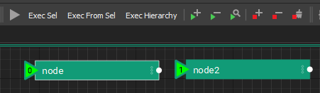

### Execution Plugs

Nodes have execution plugs on their left and right to determine execution order. Nodes are executed from left to right along the execution chain specified by these connections.

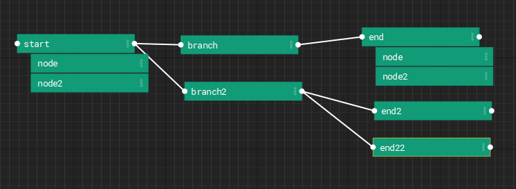

!!! danger
    We don't have checks for circular dependencies yet. So don't setup loops.

### Hierarchies/Stacks

Nodes have relationships we refer to as “parent”, “child”, and “sibling” to describe their relationship to one another inside the stage to influence composition and execution order. 

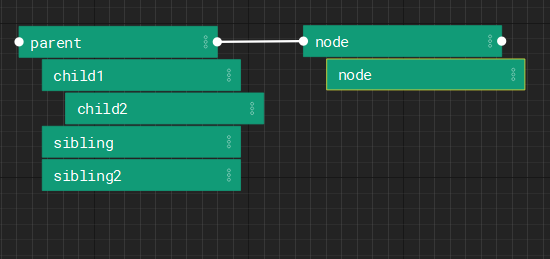

To begin execution from a given node, the first node is run, followed by a depth first execution of each of it’s descendants. Following the execution of the descendants, the root node whose input [execution plug](#execution-plugs) is connected to the current node’s output execution plug will be run following the same logic.

## Stage Composition

### Layers

[Stages ](#stage)are designed to be combined together to create a hierarchy of instructions that can be reused and repurposed by several NXT users for use on several assets or workflows. When a stage is referenced into another stage, it is a “layer” within that stage.
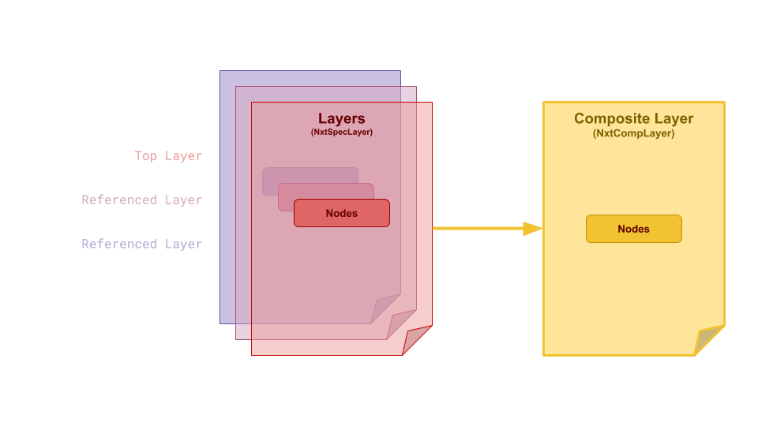
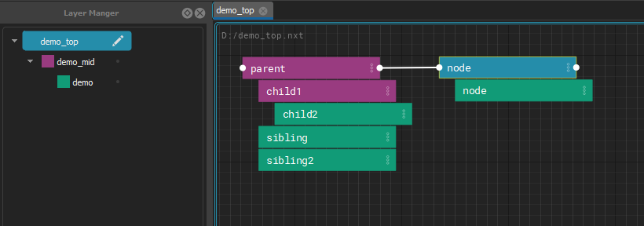

All of the layers in your file are composited together to produce final code to execute. Each layer has the power to change as much or as little as is needed to customize the composited node’s attributes and code block. These changes are stored in the file they are made on, keeping referenced files safe to use for many purposes.

Layer color propagates into nodes an also attributes.

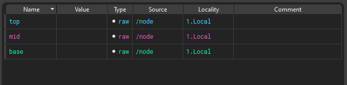

### References

A layer pulls other layers in through its **references**. They are stored in
the layer's file as a list:

    "references": [
        "base_steps.nxt",
        "$PROJECT_ROOT/lib/shared_steps.nxt"
    ]

References are a stack: the first one in the list is the strongest of them,
directly below the layer that references it, and each one after it is
weaker. A referenced layer can have references of its own.

Edit them with the [Reference Editor](#reference-editor) (right click a layer
in the Layer Manager > **Edit References...**), or add one with
**Reference Layer Above/Below** and **Reference Builtin Graph** from the
**File** menu. To pick up changes somebody else saved to any of these files,
use [Reload Source](#reload-source).

#### How references are found

A reference is stored exactly as it was written, which is often only part of
a path. When a graph is opened, nxt looks for each reference in this order
and uses the first file it finds:

1. The path as written, with environment variables (`$NAME`) and `~`
   expanded. A relative path is relative to the folder of the layer that
   holds the reference, not to wherever the top graph lives.
2. The path under each folder listed in the `NXT_FILE_ROOTS` environment
   variable, in order. Separate the folders with `;` on Windows and `:` on
   Linux and macOS.

For example, with `NXT_FILE_ROOTS=/projects/show_a;/projects/library`, the
reference `lib/shared_steps.nxt` is found at
`/projects/show_a/lib/shared_steps.nxt` if it exists there, and otherwise at
`/projects/library/lib/shared_steps.nxt`. Because what is stored is the
partial path, the same graph keeps working on another machine, or for
another project, with different roots.

The [Reference Editor](#reference-editor) shows where each reference
resolves on this machine with its resolved toggle, and the tooltip on a row
says where nxt looked.

!!! note "References that cannot be found are kept"
    If a referenced file cannot be found, for example because it lives on a
    share this machine cannot see, the graph still opens without that layer,
    and the failure is logged. The reference itself is kept on the layer
    exactly as written, so saving the layer does not remove it. The Reference
    Editor draws such references in red.

### Composition Inside Node Hierarchies

When a [node ](#node)is a child of another node, it [inherits ](concepts.md#inheritance)its [attributes ](#attributes)from that node which can be overwritten locally on the node.

## Instancing

Instancing allows you to reuse nodes from other parts of the graph with specific overrides. 

Instances in NXT can be simple and powerful. But they can also be extremely complicated with mind-bending edge cases. In simple terms, you can think about an  instance as a clone of another node. It's like a live copy. But it's a bit more nuanced to think about an instance like an additional parent that's outside the hierarchy.

!!! example

    - If you create a node, don't add any attributes or code, it will just look like a clone of the instance source.
    
    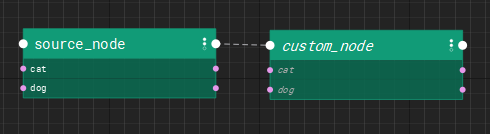
    
    - If you create a node with unique attributes it will look like the instance source is another parent. All the attributes will composite from the instance source, and the local attributes will be visible as well.
    
    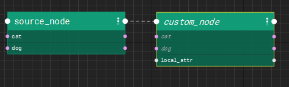
    - If you create a node with attributes named the same as the instance source, the local attributes will have a stronger opinion and overwrite the instance values. In this case, `cat` exists on `custom_node` so it's value wins.
    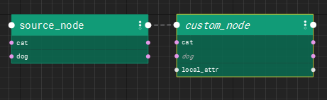

The children of the instance node get inserted into the hierarchy as proxy children. This data exists only as a result of the composite. The are not local saved data. Proxy children are drawn in a hashed style to make it clear you haven't touched the data.

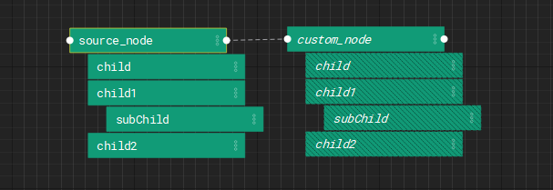

As soon as you begin to edit proxy children, the are converted into real editable nodes and exist in the hierarchy

!!! note
    The hierarchy has the final opinion in the composite. _UNLESS_ the node has an local opinion on the data.

    - Layer stage
    - Node parent
    - Node
    - Instance parent
    - Instance

!!! example
    Build a base arm. Instance it twice. Change L to R, done.
    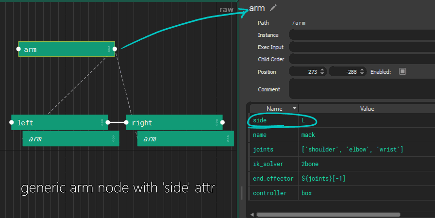

An instance of a node inherits data like a child. It creates proxy children of the instance source’s children, and can be arranged into a separate parent-child relationship as it’s instance source. 

Most instance attributes are carried over. Execution input is never inherited. Child order is inherited by instances but not by children.

Data comes from the hierarchical parent as well as the instance source, with hierarchical parent  having final word. Instance execution order is defined by the hierarchical parent.

!!! danger
    If a node instances itself, or any ancestor or descendants, it will crash. It's best (because that's all thats possible) to only instance from other hierarchies or sibling nodes

# NXT file spec

NXT files follow standard `.json` file specifications with a few specific keys in the root dictionary. 

---TODO: Figure out what these keys are.

# Design Philosophy

Nobody will ever read this pretentious wall of text, but it was an important part of the development process. We hope you find it interesting, and you may find your way here if your start to dig deeper and wonder why things are the way they are.

### Discovery

Nxt provides a visual map/model of user facing attributes that can be understood at a glance, and presents the code in context. This invites the user to extend and modify the functionality. 

Nxt is designed around making processes and code as accessible as possible with low overhead. 

- Artists can modify attributes on code templates and learn to make code changes that would normally require a TD.

- TD’s can establish layered templates for processes and write nodes and graphs.

- Developers can provide Nxt ‘factory nodes’ for using their tools without writing a custom UI.

### Functional/Procedural

Nxt follows a functional model. It eschews object oriented inheritance with a layer model. This allows data to be inspected on the fly and easily read.

##### Why not visual programming?

Nxt differs from a visual programming environment where every function (math, concatenation, data, flow control) is wrapped up in a node. Fully visual programming environments result in sprawling graphs. While the functions are readable, they are not dense. Nxt displays code standard text notation but creates a visualization for the data.

- VP graphs can be tedious to construct. A simple operation can often require a dozen nodes but could be represented in 3 lines of code.

- VP graphs are code under the surface anyway, so to extend the functionality, you need to write code, or construct graphs of graphs.

- VP is a great tool for visualization of your data and flow, readability, experimentation, and discovery.

- NXT is half visual. Half code. Seeks to keep the best parts and remove the friction for more seasoned developers.

##### Why not Houdini?

Houdini is a tool for building tools. It’s a visual processing engine. Can’t it do all of this already?

- Houdini doesn’t do layering

- Houdini is great, but maybe not the best at everything

- Artists have decades of experience in other tools

- Large segments of production already built around need to be built around Maya, Nuke, Unreal

- HDA’s are black boxes and can be slow in host applications

- PDG is great, and expensive.
  
# Application structure

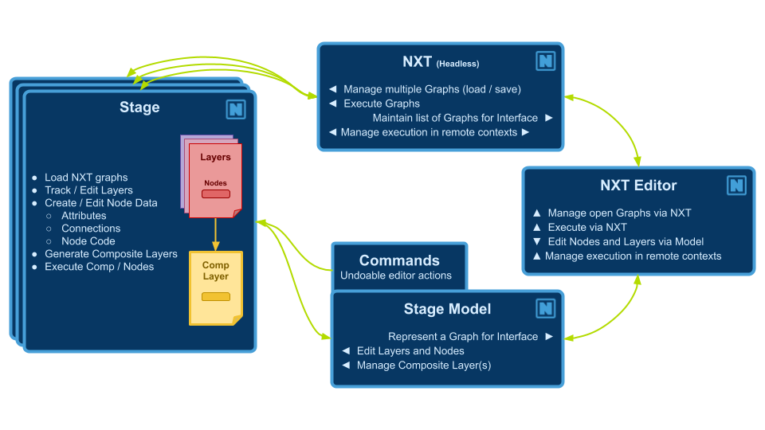
