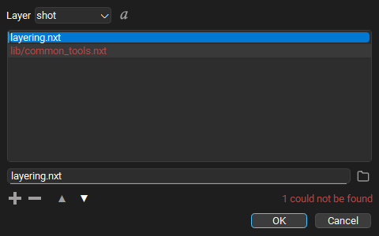
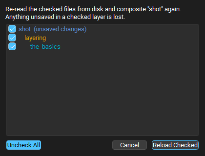

# Examples
Checkout our example content [here](https://github.com/nxt-dev/nxt_editor/tree/release/examples), you'll find `.nxt` graphs demonstrating these same topics.

If you're not quite sure how nxt fits into your workflow checkout our workflow and transition map [here](workflows.md).
Over there we explain nxt from different vantage points to help illuminate how nxt can work for you.

# Tutorials
- <a href="https://www.youtube.com/playlist?list=PL1rrB33w2Z6XJLjK0MU613euB06Z0xMuC" target=blank>Getting started YouTube Playlist</a>

## Introduction to tokens
<iframe width="560" height="315" src="https://www.youtube.com/embed/L-0UGm0tPzc" frameborder="0" allow="accelerometer; autoplay; clipboard-write; encrypted-media; gyroscope; picture-in-picture" allowfullscreen></iframe>

##### 01 Making and executing a node. Hello world.
- Make a node
- Add code
- Setup a token
- Use the output log
---
  
<iframe width="560" height="315" src="https://www.youtube.com/embed/XtPhOZmI76o" frameborder="0" allow="accelerometer; autoplay; clipboard-write; encrypted-media; gyroscope; picture-in-picture" allowfullscreen></iframe>

##### 02 Adding and using attributes and tokens in code
- Naming
- Attribute types
- More on substitution
---
  

<iframe width="560" height="315" src="https://www.youtube.com/embed/oyyPS7LtLE0" frameborder="0" allow="accelerometer; autoplay; clipboard-write; encrypted-media; gyroscope; picture-in-picture" allowfullscreen></iframe>

## Execution and Inheritance
##### 03 Making and executing a series of nodes
- Executing nodes in sequence
- Pathing to nodes and attributes
- Execution options
---
  
<iframe width="560" height="315" src="https://www.youtube.com/embed/SdkpeSXYD8o" frameborder="0" allow="accelerometer; autoplay; clipboard-write; encrypted-media; gyroscope; picture-in-picture" allowfullscreen></iframe>

##### 04 Inheriting within a stack
- Stacks execution
- Inheritance within stacks
- Parent / unparent nodes
- Changing attribute display
---
  

<iframe width="560" height="315" src="https://www.youtube.com/embed/wjhsDYKHbHI" frameborder="0" allow="accelerometer; autoplay; clipboard-write; encrypted-media; gyroscope; picture-in-picture" allowfullscreen></iframe>

##### Additional notes on execution, history, build view
- Start points
- Break points
- Build view
- History view
---
  

<iframe width="560" height="315" src="https://www.youtube.com/embed/BeCY2fNhw4c" frameborder="0" allow="accelerometer; autoplay; clipboard-write; encrypted-media; gyroscope; picture-in-picture" allowfullscreen></iframe>

##### 05 Using attributes from other nodes
- Linking to other attrs
- Pathing to other attrs
---
  

## Instances

<iframe width="560" height="315" src="https://www.youtube.com/embed/VHbzbiSaLds" frameborder="0" allow="accelerometer; autoplay; clipboard-write; encrypted-media; gyroscope; picture-in-picture" allowfullscreen></iframe>

##### 06 Node instances
- Instances
- Instance path
- Local vs instanced attributes
- Instances of instances
---
  

<iframe width="560" height="315" src="https://www.youtube.com/embed/hSrVzjS7N38" frameborder="0" allow="accelerometer; autoplay; clipboard-write; encrypted-media; gyroscope; picture-in-picture" allowfullscreen></iframe>

## More on attributes

##### 07 Notes on renaming
- NXT doesn't rename anything automatically
- But it will recomp based on name
---
  

<iframe width="560" height="315" src="https://www.youtube.com/embed/FAMVE24e6mw" frameborder="0" allow="accelerometer; autoplay; clipboard-write; encrypted-media; gyroscope; picture-in-picture" allowfullscreen></iframe>

##### 08 Attribute overloading and reverting
- Resolution order
- Node, parent, instance
---
  

<iframe width="560" height="315" src="https://www.youtube.com/embed/DXhKfTv2Ai0" frameborder="0" allow="accelerometer; autoplay; clipboard-write; encrypted-media; gyroscope; picture-in-picture" allowfullscreen></iframe>

##### 09 Writing data to attributes from code
- Using `self.attr`
- Usign raw, resolved, cached view
---
  

<iframe width="560" height="315" src="https://www.youtube.com/embed/XlXfue-7oQk" frameborder="0" allow="accelerometer; autoplay; clipboard-write; encrypted-media; gyroscope; picture-in-picture" allowfullscreen></iframe>

## Layers

##### 10 Layering and compositing
- Adding layers
- Layer display state
- Active layer
- Executing part of a layer
- Adding new attrs and overrides on a layer
---
  

##### Use of the layer object and stage object

# Walkthrough: references and reloading

This walkthrough uses the example graphs from the
[examples folder](https://github.com/nxt-dev/nxt_editor/tree/release/examples).
`layering.nxt` references `the_basics.nxt`, so opening it gives you a graph
built from two files.

##### Add a reference

1. Open `layering.nxt` with **File > Open Graph** (`Ctrl+O`).
2. In the Layer Manager, right click the **layering** layer and choose
   **Edit References...**. The list shows `the_basics.nxt`, the one reference
   this layer has.
3. Press **+**. An empty row is added and the cursor goes to the field under
   the list.
4. Type `file_list.nxt`, or press the folder button and pick the file.
   The new row is drawn normally because the file is found next to the layer.
   (Had a folder in `NXT_FILE_ROOTS` held a `file_list.nxt`, that one would
   be used instead: roots are looked in before the layer's own folder. See
   [How references are found](reference.md#how-references-are-found).)
   Type a path to a file that does not exist and the row turns red, with
   `1 could not be found` under the list.
5. Press **OK**. The referenced layers are loaded and the graph is
   composited again. The layer is now marked unsaved; **Save Layer**
   (`Ctrl+S`) writes the new reference into `layering.nxt`. **Undo**
   (`Ctrl+Z`) takes the change back.

!!! tip
    Order matters: a reference higher in the list is stronger than the ones
    below it. Drag rows to change the order. Toggle the resolved view to see
    where each reference lands on this machine.

##### Pick up somebody else's changes

1. Change `the_basics.nxt` outside this session, for example by opening it in
   a second editor, editing a node and saving.
2. Back in the first session, right click the **layering** layer and choose
   **Reload Source...**.
3. Every file the layer is built from is listed and checked. Uncheck any you
   do not want read again, then press **Reload Checked**.

The graph now shows the saved changes. Rows marked `(unsaved changes)` lose
those changes when reloaded, but **Undo** puts them back.

##### Find your way around a big compute

Select a node with code, double click into the code editor, and try:

- `Ctrl+F` to find a word, `F3` to step through the matches, and the
  chevron to replace them.
- `Ctrl+G` to jump to a line.
- `Ctrl+Space` after `os.` in a compute that imports `os`, or after `${`,
  to see what completion offers. After `${/` it offers the graph's node
  paths, and after `${/some_node.` that node's attributes.
- Leave editing (`Esc`), press `Q` for Raw View, and hover a `${}` token to
  see its value. Hold `Ctrl` and click a token that reads another node's
  attribute to jump to that node.

See [Code Editor](reference.md#code-editor) for every shortcut.

# Example Graph Walkthroughs
Still pending

##### Example: Mgear pre-post build

##### Example: Maya hand rig

##### Example: Nuke resize image sequence

##### Example: Maya cloth attribute wedge and playblast