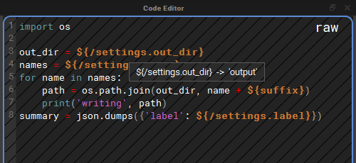
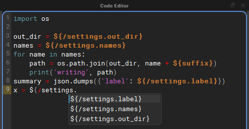

# What's New

This page summarises what is new in **nxt_editor 4.3** and **nxt_core 0.21**.
Each item links to the part of the docs that explains it in full.

## Editor

### A code editor that works like a code editor

The code editor picked up the tools you would expect from a text editor. All
of them only apply while the code editor has focus, and all of them can be
rebound in the [Hotkey Editor](hotkeys.md#code-editor).

- **Find and replace** (`Ctrl+F` / `Ctrl+H`) floats over the top right of the
  code, with a match count, next and previous (`F3` / `Shift+F3`) and toggles
  for match case, whole word and regular expressions.
- **Go to line** (`Ctrl+G`) previews the line as you type, and `Esc` puts the
  cursor back where it was.
- **Line editing**: duplicate (`Ctrl+Shift+D`), move (`Alt+Up` / `Alt+Down`)
  and delete (`Ctrl+Shift+K`) lines, and expand the selection from word to
  line to everything (`Ctrl+D`).
- **Highlighting** of every use of the word under the cursor, and of the
  bracket next to the cursor and its partner.
- **Completion** (`Ctrl+Space`) offers python builtins, names from the modules
  the compute imports, the node's attributes and `${}` tokens, and words
  already in the compute. Each source can be switched on or off under
  **Options > Autocomplete**, along with suggestions while you type.
- **Auto-pairing**: typing `(`, `[`, `{`, `"` or `'` adds the closing
  character, typing a closer that is already there steps over it, and
  typing an opener with text selected wraps the selection.
- **Syntax highlighting** colours every match on a line. Before, a line
  with two tokens or two strings only had the first one coloured.

See [Code Editor](reference.md#code-editor).

### Tokens you can hover and follow

In Raw View (`Q`), hover a `${}` token in the code editor to see what it
resolves to, and `Ctrl+click` a token that reads another node's attribute to
select and frame that node in the graph. See
[Following tokens](reference.md#following-tokens).

### Completion that knows what a compute can use

- What the world node imports completes in every node, because every
  compute can use it.
- The names nxt gives every compute complete without an import: `STAGE`,
  `self`, `w`, `execute`, `nxt_path`, `ExitNode`, `ExitGraph` and `types`.
- Inside `${/` the node paths in the graph complete, and after a node path's
  dot its attributes, each as a whole token.
- **Host Modules**, a new source: in Maya, `cmds`, `om`, `pm` and the other
  usual short names complete before any import line is written, and so do
  `unreal` in Unreal and `bpy` in Blender. Only modules the host has
  already loaded are offered, so nothing is imported to complete them.
- **Python Analysis (jedi)**, a new optional source: with
  `pip install nxt-editor[completion]`, completion after a dot knows what a
  call returns or a variable holds.

See [Completion](reference.md#completion).

### Docks

- Double click a dock's tab, where docks are tabbed together, to float it.
  Drag a floating dock back in, or double click its title bar to dock it
  again.
- **View > Reset Layout** puts every dock back where a fresh install has it.

See [Docks and layout](reference.md#docks-and-layout).

### Editing layer references

Right click a layer in the Layer Manager and choose **Edit References...** to
add, remove, retype and reorder what that layer references, without opening
the file in a text editor. Paths can be typed exactly as you want them
stored (for example with an environment variable in them), or picked with a
file browser. A **resolved** toggle shows where each reference lands on this
machine, and references that cannot be found are kept and marked rather than
dropped. See [Reference Editor](reference.md#reference-editor).

### Reload Source

Somebody else saved a file your graph is built on? **Reload Source...** (on a
layer's right click menu and in the **File** menu) re-reads that layer, and
as many of the layers it references as you choose, from disk, and
composites the graph again. It can be undone. See
[Reload Source](reference.md#reload-source).

### Mini map

A mini map in the bottom right of the graph shows the whole graph and where
the view is inside it. Click or drag in it to move the view. Toggle it with
**View > Toggle Mini Map** or `Ctrl+M`. See [Stage](reference.md#stage-view).

### Build view

- A **find** button next to the play button scrolls the build to the node
  selected in the graph, and tells you when the selected node is not part of
  the build.
- The build stays current as the graph changes: disabling, deleting,
  renaming, re-parenting or reconnecting a node updates it straight away.

See [Build View](reference.md#build-view).

### Smaller changes

- Deleting a node no longer leaves a "ghost" of it in the graph and the
  build view.
- Pasting several nodes is a single undo.
- Nodes no longer animate open by default, which makes opening a node with
  many children noticeably faster. The **Animate Nodes** action turns the
  animation back on (see [Stage](reference.md#stage-view)).
- A graph is only composited and drawn when its tab is first selected, so
  opening many files at once is faster.
- Renaming a node no longer rebuilds the whole graph when it does not need
  to, and a renamed node keeps its position.
- When a build is set up, a cached runtime that no longer matches the graph
  is rebuilt automatically instead of stopping the build part way through.
- An uncaught error from nxt only opens a dialog when an editor window is
  visible. In batch or headless sessions it is printed instead, so a host
  running a graph in the background never stops on a dialog nobody can see.
- The editor no longer needs `pyside6-rcc` (or any other compiled step) to
  build its icons and styles, so the same release works on every platform
  and host.

## Host integrations

- **Maya**: Maya 2025, 2026 and 2027 are supported. The `nxt_ui` command
  takes `-path` to open graphs, `-close` and `-reload`, and reuses the editor
  that is already open. Graphs can be run in Maya standalone from the
  command line with `run_maya_graph.py`, including a start node and
  parameters, and the builtin `_maya_standalone_graph` node now passes its
  `_start_node` on. See [Maya](install.md#maya).
- **Unreal**: a plugin for Unreal 5.4 to 5.8 that carries its own copy of nxt,
  nxt_editor and Qt.py, with an **nxt** menu and a one click
  **Install Qt (PySide6)**. See [Unreal](install.md#unreal).
- **Blender**: an add-on for Blender 4.2 and newer with an **NXT** menu:
  Open Editor, Close Editor, Run Graph, Run Last Graph, Reload Code and
  Install Qt. See [Blender](install.md#blender).
- Hosts that do not ship Qt install PySide6 once into `~/nxt/deps`, or into a
  shared folder named by `NXT_QT_DEPS`. See
  [Qt for Blender and Unreal](install.md#qt-for-blender-and-unreal).

## Python versions

| Package | Python |
| :------ | :----- |
| nxt-core | 3.7 to 3.14 |
| nxt-editor | 3.9 to 3.14 (PySide6 6.x, below 6.12) |

PySide6 is held below 6.12 until the editor has been tested on it.

## Core (nxt_core 0.21)

- **Faster compositing and execution.** Large graphs composite and build
  substantially faster, with identical results.
- **One order for finding a reference, everywhere.** A reference written
  as an absolute path is used as it is. Any other reference is looked for
  under the folders in `NXT_FILE_ROOTS` first, and then relative to the
  layer that holds it, never relative to wherever the editor was started.
  A file under a root therefore wins over a file of the same name beside
  the layer, which is what lets a working copy listed in `NXT_FILE_ROOTS`
  stand in for the published one. Adding a reference in the editor now
  finds the same file that opening the graph does. See
  [How references are found](reference.md#how-references-are-found).
- **References that cannot be resolved are kept.** Previously a reference to
  a file that could not be found was dropped from the layer, and saving the
  layer wrote it out without the reference. Now it is kept exactly as
  written, so a graph opened on a machine that cannot see a share no longer
  loses its references when saved.
- **Reloading layers from disk** (`Stage.reload_layers`), which is what
  [Reload Source](reference.md#reload-source) is built on. A reference added,
  removed or reordered in the file since the graph was opened is picked up.
- **Removing a layer removes everything it brought in**, including all of its
  references, and only the reference that pointed at it.
- **Targeted renames**: renaming a node that nothing else composites against
  updates it in place instead of recompositing the stage.
- Graph parameters can enable or disable nodes for a run, for example
  `{"/node._enabled": false}`. See
  [Running a graph in Maya standalone](install.md#running-a-graph-in-maya-standalone).
